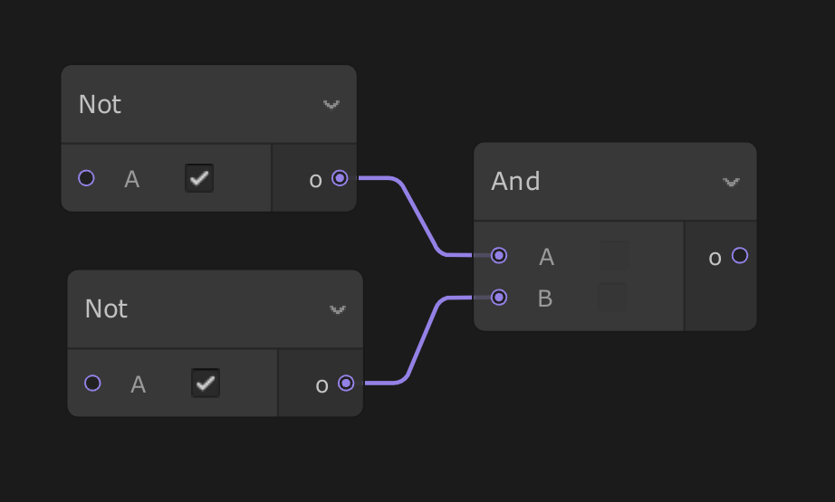

# Nand (Logic)

Menu Path : **Operator > Logic > Nand**

The **Nand** Operator takes two inputs and outputs the result of a logical *nand* operation between them. *Nand* is a composite operation that first calculates the *not* of the inputs and then calculates the *and* of the results. The result of A **Nand** B is `true` if both A and B are `false`. This operator is equivalent to the C# `!` operator followed by the `&&` operator.

## Operator properties

| **Input** | **Type** | **Description**                                              |
| --------- | -------- | ------------------------------------------------------------ |
| **A**     | bool     | The left operand. If this and **B** are `false` then **o** is `true`. |
| **B**     | bool     | The right operand. If this and **A** are `false` then **o** is `true`. |

| **Output** | **Type** | **Description**                                              |
| ---------- | -------- | ------------------------------------------------------------ |
| **o**      | bool     | If **A** and **B** are `false`, this value is `true`. Otherwise, if either **A** or **B** are `true` this value is `false`. |

## Note

This Operator provides the same result as the following graph :
